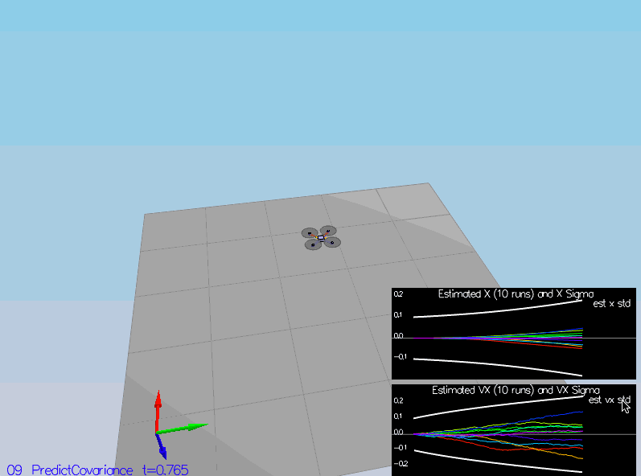

# Implement Estimator

## Determine the standard deviation of the measurement noise of both GPS X data and Accelerometer X data.

As highlighted in the readme file the `06_NoisySensors` scenario will log the sampled `GPSPosXY` and `AccelXY` data to the `Graph1.txt` and `Graph2.txt` files. I calculated the standard deviation for each file using the following snippet. Full source code is available on the `stddev.py` file.

```python
def calculate_std(file_path, axis=1, skip_first_line = True):
    with open(file_path) as reader:
        if skip_first_line:
            reader.readline()
        
        values = list(map(lambda columns: float(columns[axis]), (map(lambda line: line.removesuffix('\n').split(','), reader.readlines()))))

        return np.std(values)
```

The code generated the following standard deviations ...

```
MeasuredStdDev_GPSPosXY = 0.7204715190847948
MeasuredStdDev_AccelXY = 0.5094056735130489
```

Updating the `06_NoisySensors` config file with those values allowed the tests to pass.

```
PASS: ABS(Quad.GPS.X-Quad.Pos.X) was less than MeasuredStdDev_GPSPosXY for 68% of the time
PASS: ABS(Quad.IMU.AX-0.000000) was less than MeasuredStdDev_AccelXY for 69% of the time
```

## Implement a better rate gyro attitude integration scheme in the UpdateFromIMU() function.

The implementation aims to follow the *Nonlinear Complementary Filter* of the *Three Dimensional Quad* section from the [Estimation for Quadrotors](https://www.overleaf.com/project/5c34caab7ecefc04087273b9) document.

I created a quaternion using the `Quaternion<float>::FromEuler123_RPY` from the roll, pitch & yaw estimated euler angles. Then, integrated the gyro rate using the `IntegrateBodyRate`.

This provided us with the updated pitch roll and yaw estimations. Finally, we had to normalise the yaw value.

## Implement all of the elements of the prediction step for the estimator.

The implementation assigns the predicted state values by incrementing the current state with the current state velocities and the vehicle acceleration.

Predicted state position for each coordinate axis in the global frame is calculated using 

```python
// pos_x = pos_x + (vel_x * elapsed_time)

predictedState = curState;

predictedState(0) += curState(3) * dt;
predictedState(1) += curState(4) * dt;
predictedState(2) += curState(5) * dt;
```

Predicted state velocity for each coordinate axis in the global frame is calculated using ...

```python
// vel_x = vel_x + (acc_x * elapsed_time)

V3F inertial_accel = attitude.Rotate_BtoI(accel);

predictedState(3) += inertial_accel.x * dt;
predictedState(4) += inertial_accel.y * dt;
predictedState(5) += (inertial_accel.z - CONST_GRAVITY) * dt;
```

Important thing here was to convert the acceleration measurements in the body from to the global frame, before calculating the predicted state.

## Implement the magnetometer update.

The implementation aims to follow the *Magnetometer* of the *Three Dimensional Quad* section from the [Estimation for Quadrotors](https://www.overleaf.com/project/5c34caab7ecefc04087273b9) document.

It sets the yaw index of the hPrime to 1, while leaving the rest as 0. Also, sets the estimated yaw to the `zFromX(0)`.

If the angle difference between the measured magnetometer and the estimated yaw values are outside the [-PI, PI] range, we have to normalise values by shifting either one of them by 2 PI. In the given solution, I modified the magnetometer measurement.

## Implement the GPS update.

As stated in the source code, this was a pretty straight forward update. We just had to set hPrime to the identity matrix and update the zFromX with the ekf state.

# Flight Evaluation

## Meet the performance criteria of each step.

### 06_SensorNoise


### 07_AttitudeEstimation


### 08_PredictState


### 09_PredictCovariance


### 10_MagUpdate


### 11_GPSUpdate


## De-tune your controller to successfully fly the final desired box trajectory with your estimator and realistic sensors.

### 02_AttitudeControl

After implementing the QuadControl, `Quad.Omega.X` was passed by default with the given `kpPQR` values (i.e., 70, 70, 15). 

I had to increase `kpBank` value to 14 to make the `Quad.Roll` test pass. However, it was nearly impossible to highlight the pass mark (green rectangle) on the simulator on a gif. To have better visuals on the project I kicked it up a notch to 15. That have us better visuals on the test results


### 03_PositionControl

After completing the previous scenario, `Quad2.Yaw` was passed by default with the given `kpYaw` (i.e., 3) and `kpPQR` values. 

I had to increase `kpPosXY` value to 16 to make the `Quad1.Pos.X` and `Quad2.Pos.X` tests to pass.


### 04_Nonidealities

After completing the previous scenario, none of the tests passed for the 4th scenario.

I had to increase the `kpPosXY` value to 20 to make the `Quad2.PosFollowErr` test to pass. 

I had to increase the `kpPosZ` value to 17 to make the `Quad3.PosFollowErr` test to pass.

I had to decrease the `kiPosZ` value to 35 to make the `Quad1.PosFollowErr` test to pass.

